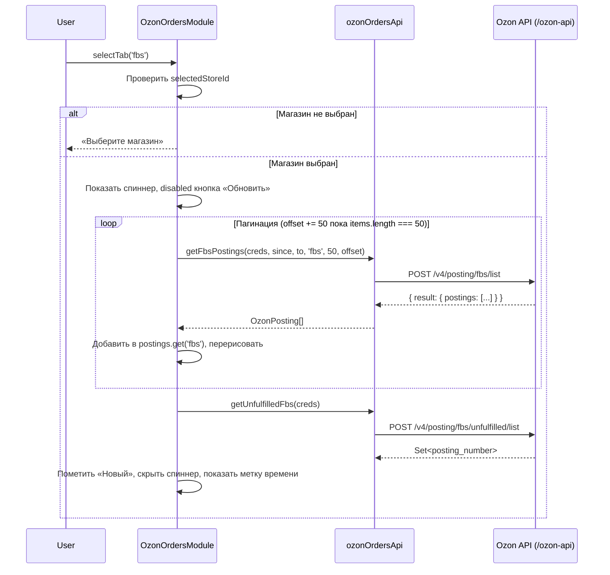

# Design Document — orders-marketplace

## Overview

Фича добавляет раздел **«Заказы»** в существующее SPA STOCKBASE (TypeScript + Vite, Supabase, Ozon API).

Ключевые изменения:
- В боковой навигации появляется пункт «Заказы» с вложенной группой «Маркетплейсы → Ozon».
- Существующий пункт «Ozon» верхнего уровня удаляется из sidebar; сам `OzonModule` (управление товарами) остаётся без изменений и вызывается через новую иерархию.
- Новый `OzonOrdersModule` отображает заказы Ozon по трём схемам доставки: **FBO**, **FBS**, **RealFBS**.
- Все запросы к Ozon Seller API идут через существующий прокси `/ozon-api` с теми же заголовками `Client-Id` / `Api-Key`.

### Исследование API

Использованные эндпоинты Ozon Seller API (v3/v4):

| Схема | Список | Детали | Необработанные |
|-------|--------|--------|----------------|
| FBO | `POST /v3/posting/fbo/list` | `POST /v2/posting/fbo/get` | — |
| FBS | `POST /v4/posting/fbs/list` (`delivery_schema: ["fbs"]`) | `POST /v3/posting/fbs/get` | `POST /v4/posting/fbs/unfulfilled/list` |
| RealFBS | `POST /v4/posting/fbs/list` (`delivery_schema: ["rfbs"]`) | `POST /v3/posting/fbs/get` | — |
| Возвраты RealFBS | `POST /v2/returns/rfbs/list` | — | — |

Пагинация: `limit` / `offset`-based; загрузка продолжается пока `response.result.postings.length === limit`.

Retry-стратегия (унаследована из `ozonApi.ts`): exponential backoff `min(2^(n-1) * 1000, 32000)` мс, до 5 попыток, только для статусов `{429, 500, 502, 503}`.

---

## Architecture

Приложение остаётся SPA без фреймворка (vanilla TypeScript). Новые компоненты встраиваются в существующую архитектуру.

```mermaid
graph TD
    App["App (src/App.ts)"]
    Nav["Sidebar Navigation (index.html)"]
    OM["OzonModule (существующий)"]
    OOM["OzonOrdersModule (новый)"]
    OApi["ozonApi (существующий)"]
    ODb["ozonDb (существующий)"]
    OOrdersApi["ozonOrdersApi (новый сервис)"]
    Types["src/types/ozon.ts (расширяется)"]

    App -->|navigateTo('orders')| OOM
    App -->|navigateTo('ozon-orders')| OOM
    App -->|ozonModule.show()| OM
    Nav --> App
    OOM --> OOrdersApi
    OOM --> ODb
    OOrdersApi -->|/ozon-api/*| OApi
    OOM --> Types
    OM --> OApi
    OM --> ODb
```

### Принципы интеграции

1. **Без фреймворка** — новые модули следуют паттерну `OzonModule`: класс с методами `init()`, `show()`, `hide()`, `render()`.
2. **Единый прокси** — все запросы через `/ozon-api`, заголовки из `OzonStore.client_id` / `api_key`.
3. **Реактивность через DOM** — состояние хранится в полях класса, UI перерисовывается через `innerHTML`.
4. **Кеш в памяти** — детали отправлений кешируются в `Map<string, OzonPosting>` на время сессии.

---

## Components and Interfaces

### 1. Изменения в `index.html` — Sidebar

Текущий пункт `nav-item[data-section="ozon"]` удаляется. Добавляется:

```html
<!-- Заказы -->
<div class="nav-item" id="nav-orders" data-section="orders"
     onclick="window.app.navigateTo('orders')">
  <svg><!-- иконка корзины --></svg>
  Заказы
</div>

<!-- Группа «Маркетплейсы» (скрыта по умолчанию) -->
<div class="nav-group" id="nav-group-marketplaces" style="display:none">
  <div class="nav-group-label">Маркетплейсы</div>
  <div class="nav-item nav-item-sub" id="nav-ozon-orders" data-section="ozon-orders"
       onclick="window.app.navigateTo('ozon-orders')">
    <svg><!-- иконка Ozon --></svg>
    Ozon
  </div>
</div>
```

Секция `#orders-section` добавляется в `<div class="main">` рядом с `#ozon-content`.

### 2. Изменения в `App.ts`

Метод `navigateTo` расширяется для поддержки новых маршрутов:

```typescript
navigateTo(page: 'home' | 'products' | 'orders' | 'ozon-orders', opts?: { loadAll?: boolean }): void
```

Логика:
- `'orders'` → показывает `#orders-section`, инициализирует `OrdersModule`, раскрывает `#nav-group-marketplaces`.
- `'ozon-orders'` → показывает `#orders-section`, вызывает `ozonOrdersModule.show()`.
- При переходе в любой другой раздел → скрывает `#nav-group-marketplaces`.

### 3. `OzonOrdersModule` (`src/modules/OzonOrdersModule.ts`)

```typescript
export class OzonOrdersModule {
  private stores: OzonStore[] = [];
  private selectedStoreId: string | null = null;
  private activeTab: DeliveryScheme = 'fbs';
  private postings: Map<DeliveryScheme, OzonPosting[]> = new Map();
  private returns: OzonReturn[] = [];
  private detailsCache: Map<string, OzonPosting> = new Map();
  private loading = false;
  private abortController: AbortController | null = null;
  private lastUpdated: Date | null = null;
  private filters: OrderFilters = { status: '', dateFrom: '', dateTo: '', search: '' };
  private container: HTMLElement;

  constructor(container: HTMLElement) { ... }

  async init(): Promise<void>
  show(): void
  hide(): void
  render(): void

  // Публичные методы (вызываются из inline-обработчиков)
  selectTab(scheme: DeliveryScheme): void
  selectStore(id: string | null): void
  refresh(): void
  stopLoading(): void
  openPostingModal(postingNumber: string, scheme: DeliveryScheme): void
  setFilter(key: keyof OrderFilters, value: string): void
  resetFilters(): void
  loadMore(): void
}
```

### 4. `ozonOrdersApi` (`src/services/ozonOrdersApi.ts`)

Новый сервис, аналогичный `ozonApi.ts`:

```typescript
type Creds = Pick<OzonStore, 'client_id' | 'api_key'>;

export const ozonOrdersApi = {
  getFboPostings(creds: Creds, since: string, to: string, limit: number, offset: number): Promise<OzonPosting[]>
  getFbsPostings(creds: Creds, since: string, to: string, scheme: 'fbs' | 'rfbs', limit: number, offset: number): Promise<OzonPosting[]>
  getUnfulfilledFbs(creds: Creds): Promise<Set<string>>  // posting_numbers
  getRfbsReturns(creds: Creds, limit: number, offset: number): Promise<OzonReturn[]>
  getFboPostingDetail(creds: Creds, postingNumber: string): Promise<OzonPosting>
  getFbsPostingDetail(creds: Creds, postingNumber: string): Promise<OzonPosting>
}
```

Все методы используют внутреннюю функцию `ozonOrdersPost<T>` с той же retry-логикой, что и `ozonPost` в `ozonApi.ts`.

### 5. Расширение `src/types/ozon.ts`

```typescript
export type DeliveryScheme = 'fbo' | 'fbs' | 'rfbs';

export type OzonPostingStatus =
  | 'awaiting_packaging'
  | 'awaiting_deliver'
  | 'delivering'
  | 'delivered'
  | 'cancelled'
  | 'arbitration'
  | 'not_accepted'
  | 'sent_by_seller';

export interface OzonPostingProduct {
  offer_id: string;
  name: string;
  quantity: number;
  price: string;
  currency_code: string;
}

export interface OzonPosting {
  posting_number: string;
  status: OzonPostingStatus;
  delivery_scheme: DeliveryScheme;
  created_at: string;
  shipment_date: string | null;
  products: OzonPostingProduct[];
  store_id: string;
  // Опциональные поля
  in_process_at?: string | null;
  delivering_date?: string | null;
  warehouse_id?: number | null;
  customer_address?: string | null;
  tracking_number?: string | null;
  region?: string | null;
}

export interface OzonReturn {
  id: number;
  status: string;
  posting_number: string;
  created_at: string;
  products: OzonPostingProduct[];
  reason_name?: string;
}

export interface OrderFilters {
  status: string;
  dateFrom: string;
  dateTo: string;
  search: string;
}
```

---

## Data Models

### Поток данных при загрузке вкладки



### Структура состояния `OzonOrdersModule`

```
OzonOrdersModule {
  stores: OzonStore[]                          // из ozonDb.getStores()
  selectedStoreId: string | null
  activeTab: 'fbo' | 'fbs' | 'rfbs'
  postings: Map<DeliveryScheme, OzonPosting[]> // загруженные отправления по схеме
  returns: OzonReturn[]                        // возвраты RealFBS
  detailsCache: Map<string, OzonPosting>       // кеш деталей по posting_number
  unfulfilledSet: Set<string>                  // posting_numbers из unfulfilled/list
  loading: boolean
  abortController: AbortController | null
  lastUpdated: Date | null
  filters: OrderFilters
  displayedCount: number                       // для виртуальной пагинации «Показать ещё»
}
```

### Маппинг ответов API → `OzonPosting`

**FBO** (`/v3/posting/fbo/list`):
```
result.postings[i] → OzonPosting {
  posting_number: posting.posting_number,
  status: posting.status,
  delivery_scheme: 'fbo',
  created_at: posting.created_at,
  shipment_date: posting.in_process_at ?? null,
  in_process_at: posting.in_process_at ?? null,
  products: posting.products.map(p => ({
    offer_id: p.offer_id, name: p.name,
    quantity: p.quantity, price: p.price, currency_code: p.currency_code
  })),
  store_id: <выбранный storeId>,
  warehouse_id: posting.delivery_method?.warehouse_id ?? null,
}
```

**FBS / RealFBS** (`/v4/posting/fbs/list`):
```
result.postings[i] → OzonPosting {
  posting_number: posting.posting_number,
  status: posting.status,
  delivery_scheme: posting.delivery_method?.name === 'Реальный FBS' ? 'rfbs' : 'fbs',
  created_at: posting.created_at,
  shipment_date: posting.shipment_date ?? null,
  delivering_date: posting.delivering_date ?? null,
  products: posting.products.map(...),
  store_id: <выбранный storeId>,
  warehouse_id: posting.delivery_method?.warehouse_id ?? null,
  customer_address: posting.customer?.address ?? null,
  tracking_number: posting.tracking_number ?? null,
}
```

---

## Correctness Properties

*A property is a characteristic or behavior that should hold true across all valid executions of a system — essentially, a formal statement about what the system should do. Properties serve as the bridge between human-readable specifications and machine-verifiable correctness guarantees.*

### Property 1: Счётчик вкладки равен длине массива отправлений

*For any* массива отправлений `postings` переданного в `OzonOrdersModule` для схемы `scheme`, числовой счётчик, отображаемый рядом с вкладкой `scheme`, должен быть строго равен `postings.length`.

**Validates: Requirements 3.5**

---

### Property 2: Пагинация — количество запросов соответствует числу страниц

*For any* числа страниц N ≥ 1, где каждая страница кроме последней содержит ровно `limit` записей, а последняя — меньше `limit`, `OzonOrdersModule` должен отправить ровно N запросов с `offset` равными `0, limit, 2*limit, ..., (N-1)*limit`.

**Validates: Requirements 4.2, 5.2, 6.1**

---

### Property 3: Рендер обязательных полей отправления

*For any* валидного объекта `OzonPosting`, при рендере строки таблицы должны присутствовать: `posting_number`, `status`, `created_at`, хотя бы один `offer_id` из `products`, итоговая сумма заказа.

**Validates: Requirements 4.3, 5.3, 6.2**

---

### Property 4: Retry только для retryable-статусов

*For any* HTTP-статуса из множества `{429, 500, 502, 503}`, при получении этого статуса `ozonOrdersApi` должен повторить запрос; для любого статуса вне этого множества повтор не должен выполняться.

**Validates: Requirements 4.4, 5.5, 6.5**

---

### Property 5: Правильный эндпоинт по схеме доставки

*For any* `posting_number` и схемы доставки `scheme`, при открытии детальной карточки должен вызываться эндпоинт `/v2/posting/fbo/get` если `scheme === 'fbo'`, и `/v3/posting/fbs/get` если `scheme === 'fbs'` или `scheme === 'rfbs'`.

**Validates: Requirements 7.2, 7.3**

---

### Property 6: Кеш деталей — повторный запрос не отправляется

*For any* `posting_number`, если детали этого отправления уже были успешно загружены в текущей сессии, повторное открытие модального окна не должно увеличивать количество вызовов `fetch`.

**Validates: Requirements 7.6**

---

### Property 7: Фильтрация по тексту — корректность результата

*For any* строки поиска `q` и массива отправлений `postings`, результат клиентской фильтрации должен содержать только те отправления, у которых `posting_number.toLowerCase().includes(q.toLowerCase())` ИЛИ хотя бы один `product.offer_id.toLowerCase().includes(q.toLowerCase())`.

**Validates: Requirements 8.3**

---

### Property 8: Фильтрация не вызывает новых запросов к API

*For any* изменения значения фильтра (статус, дата, поиск) после завершения начальной загрузки, количество вызовов `fetch` не должно увеличиваться.

**Validates: Requirements 8.4**

---

### Property 9: Сериализация OzonPosting — round-trip

*For any* валидного объекта `OzonPosting`, `JSON.parse(JSON.stringify(posting))` должен возвращать объект, у которого значения всех обязательных полей (`posting_number`, `status`, `delivery_scheme`, `created_at`, `shipment_date`, `products`, `store_id`) строго равны (`===`) значениям исходного объекта.

**Validates: Requirements 11.5**

---

## Error Handling

### Стратегия обработки ошибок

| Сценарий | Поведение |
|----------|-----------|
| `ozonDb.getStores()` завершился ошибкой | Показать «Не удалось загрузить список магазинов» + кнопку «Повторить» |
| HTTP retryable (429/500/502/503), попытки 1–5 | Exponential backoff, повтор |
| HTTP retryable, все 5 попыток исчерпаны | Показать сообщение с HTTP-статусом и телом ответа |
| HTTP non-retryable (400, 401, 403, 404) | Немедленно показать сообщение об ошибке |
| Ошибка при загрузке деталей отправления | Показать ошибку внутри модального окна, не закрывать его |
| Пользователь нажал «Стоп» | `AbortController.abort()`, показать уже загруженные данные |
| Список магазинов пуст | Показать «Нет подключённых магазинов. Добавьте магазин в разделе Ozon» |

### Формат сообщений об ошибках

```typescript
// Внутри OzonOrdersModule
private showError(message: string): void {
  // Рендерит div.oz-error с иконкой и текстом
}

private showApiError(status: number, body: string): void {
  this.showError(`Ошибка API: HTTP ${status} — ${body.slice(0, 200)}`);
}
```

### AbortController

При нажатии «Стоп» или при повторном вызове `refresh()`:
```typescript
this.abortController?.abort();
this.abortController = new AbortController();
```

Все `fetch`-вызовы в `ozonOrdersApi` принимают `signal: AbortSignal` и корректно обрабатывают `AbortError`.

---

## Testing Strategy

### Применимость Property-Based Testing

Фича содержит чистую логику (пагинация, фильтрация, маппинг данных, сериализация), которая хорошо поддаётся PBT. Используется **fast-check** (TypeScript-совместимая PBT-библиотека, уже совместима с Vitest).

### Unit-тесты (example-based)

Покрывают конкретные сценарии:
- Рендер sidebar с новой иерархией навигации
- Активация/деактивация CSS-класса `active` при навигации
- Отображение «Нет подключённых магазинов» при пустом списке
- Отображение «Заказов нет» при пустом массиве отправлений
- Отображение «Выберите магазин» при отсутствии выбранного магазина
- Кнопка «Сбросить фильтры» активна/неактивна в зависимости от состояния фильтров
- Метка «Обновлено: ДД.ММ ЧЧ:ММ» после успешной загрузки
- Бейдж «Новый» для FBS-отправлений из `unfulfilled/list`
- Правильные заголовки `Client-Id` / `Api-Key` в запросах

### Property-тесты (fast-check, минимум 100 итераций)

Каждый тест реализует одно свойство из раздела «Correctness Properties»:

```typescript
// Пример: Property 7 — фильтрация по тексту
import fc from 'fast-check';
import { describe, it } from 'vitest';

// Feature: orders-marketplace, Property 7: text filter correctness
describe('OzonOrdersModule text filter', () => {
  it('returns only postings matching query in posting_number or offer_id', () => {
    fc.assert(fc.property(
      fc.array(arbOzonPosting()),
      fc.string({ minLength: 1, maxLength: 20 }),
      (postings, query) => {
        const result = filterPostings(postings, { search: query });
        return result.every(p =>
          p.posting_number.toLowerCase().includes(query.toLowerCase()) ||
          p.products.some(pr => pr.offer_id.toLowerCase().includes(query.toLowerCase()))
        );
      }
    ), { numRuns: 100 });
  });
});
```

Аналогично реализуются тесты для Properties 1–9.

### Интеграционные тесты

- Проверка корректности тела запроса к `/v3/posting/fbo/list` (поля `since`, `to`, `limit`, `offset`)
- Проверка корректности тела запроса к `/v4/posting/fbs/list` (поле `delivery_schema`)
- Проверка заголовков `Client-Id` / `Api-Key` в запросах

### Конфигурация тестов

```typescript
// vitest.config.ts — уже настроен в проекте
// Добавить fast-check:
// npm install --save-dev fast-check@^3.22.0
```

Каждый property-тест тегируется комментарием:
```typescript
// Feature: orders-marketplace, Property N: <текст свойства>
```
